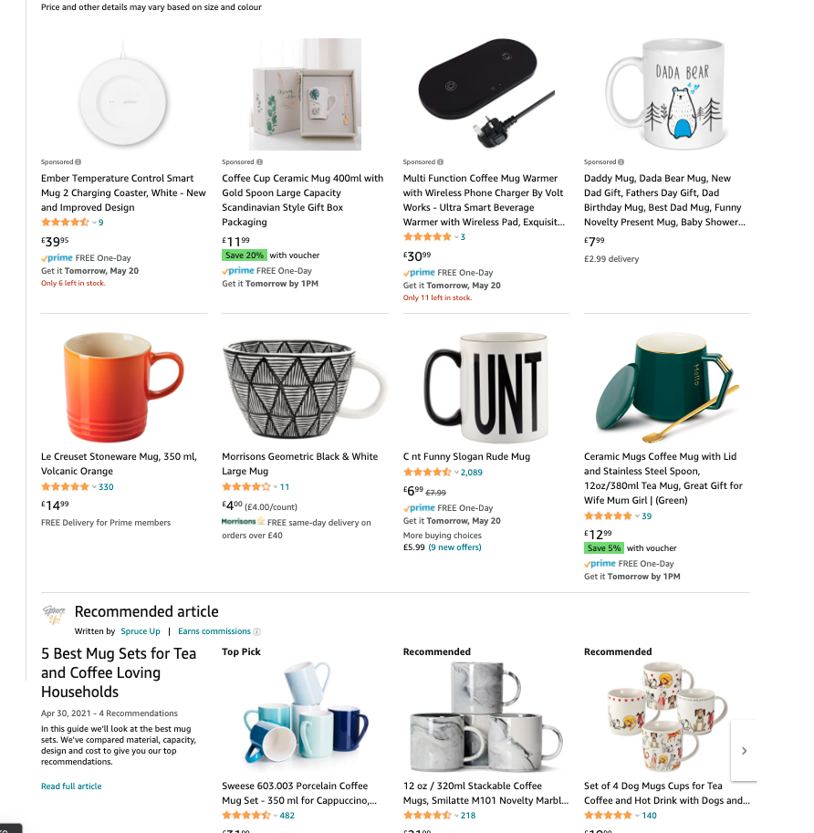
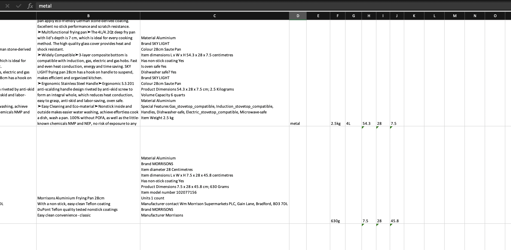

# Object Properties Information Extraction
This repository contains information and tool that is used to download web content information from **Amazon** only.

The original usage of this repository is for my final year project - Exploratory action selection for discovering object properties - which is mainly a deep learning project that aims to use NLP method to extract information from text.

Since this is a novel problem, data collection is needed and this repo has the following purpose and usage:
- Download product information (text) from **Amazon** only and generate the information into a spreadsheet (.xlsx) for data labelling
- Download the corresponding product image

# Sections that are downloaded from Amazon (in order)
- Product title
- 'Product Table' (Above **About this item**)
- About this item
- Technical Details

# Dataset and labelling
Newest update on the generated .xlsx file:
- The generated spreadsheet will now also contains the unstructured (like paragraph, normal english text) and structured text (table format, e.g. technical details section) in addtion to the original input (unstructured + structured)
- Current properties (pre-defined and labelling)
  - Material, Colour, Weight, Volume, Length, Width, Height, Object

# Usage and workflow of the main script `./script.py`
1. Create `./object_html_json/<object_name>_html.json` file which contains an array of the object links
2. Run the script by `python3 ./script.py -f <target-json-file> -obj <object-name>` which will generate a spreadsheet in `.xlsx` format for labelling
3. To download image (if you need to), I recommend you do this after you generated the spreadsheet in a separate sesson as this can reduce the work load if you were doing this in one go. The image can be downloaded by using `python3 ./script.py -f <target-json-file> -obj <object-name> -img true`

Examples:

To generate the `web_scrape_mug.xlsx`

`python3 ./script.py -f ./object_html_json/mug_html.json -obj mug`

To download images for **mug**

`python3 ./script.py -f ./object_html_json/mug_html.json -obj mug -img true`
# Data collection from Amazon (Manually adding link to your .json file)
There are things that need to be aware of when you are collecting the links required for the `.json` file before generating the spreadsheet, which will be descible below.

Work flow
- Go to https://www.amazon.co.uk/ and search your require object/product (e.g. a mug)
- When you are selecting which product you want to add to your dataset, avoid adding the product which has the **Sponsored** label or within the **Recommended article** section. This is because these advertised product are likely to re-appear again in the next pages, we try to avoid it to prevent duplicate data. (Shown in the image below)
- Secondly try to avoid selecting a product which is a set (e.g. set of mugs, 4 baking tray, 3 plates, etc.)

# Changes to the code
Note that sometime the program does not run if you access it too often (As you may see from my comment in `./script.py` that Amazon will block bot access). Therefore if you see there are all exceptions in the console output please change the `sess.headers['User-Agent']` defined in the main
# Repository Structure
- `./script.py`: a script that is used to download product information from Amazon
- `./images/` contains the images of different objects, corresponding to the links in `./object_html_json/<object>.json`

# For automatic labelling
- Labelling dataset is a very tedious job, especially when we have many output classes and properties to be labelled. There I have written a script `./auto_label.py` which uses regular expression (RegEx) to help us to the tedious job. Note that this script only label a **PROPORTION** of data (not 100%), and in addition a quick manual check should be carried out after this script is run. Nevertheless, this script will still be able to save a lot of time for the labelling job.

To run the script

`python3 ./auto_label.py ./spreadsheet/web_scrape_<object-name>.xlsx`

Example for mug

`python3 ./extract_size.py ./spreadsheet/web_scrape_mug.xlsx`

## Result
You can see that there will still be some gaps after the script is run

# Current status of the number of available product information
| Object      | Spreadsheet             | Image               | Labelled?           |
| :---        |    :----:               |        :----:       |                ---: |
| Mug         | :white_check_mark:      | :white_check_mark:  | :white_check_mark:  |
| Kettle      | :white_check_mark:      | :white_check_mark:  | :white_check_mark:  |
| Bottle      | :white_check_mark:      | :white_check_mark:  | :white_check_mark:  |
| Baking tray | :white_check_mark:      | :white_check_mark:  | :white_check_mark:  |
| Hammer      | :white_check_mark:      | :white_check_mark:  | :white_check_mark:  |
| Pan         | :white_check_mark:      |    |  |